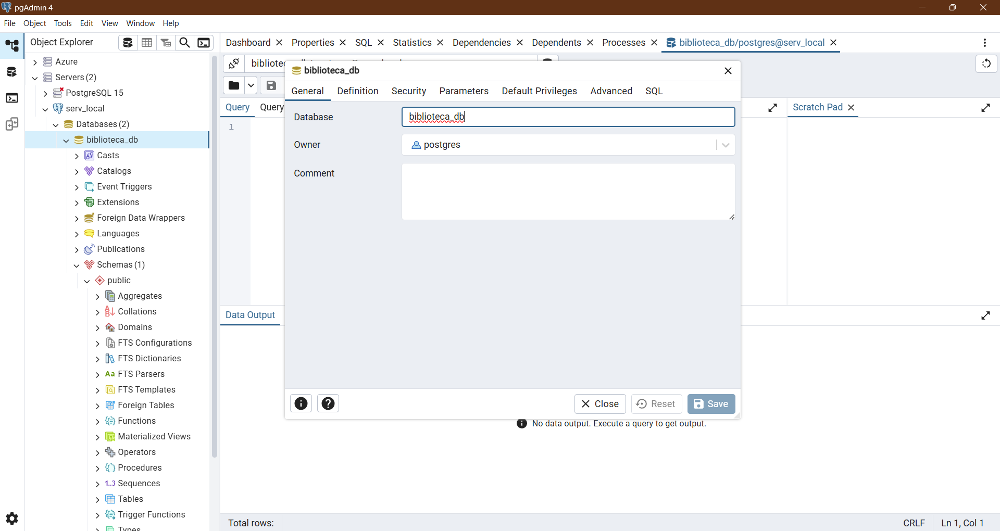
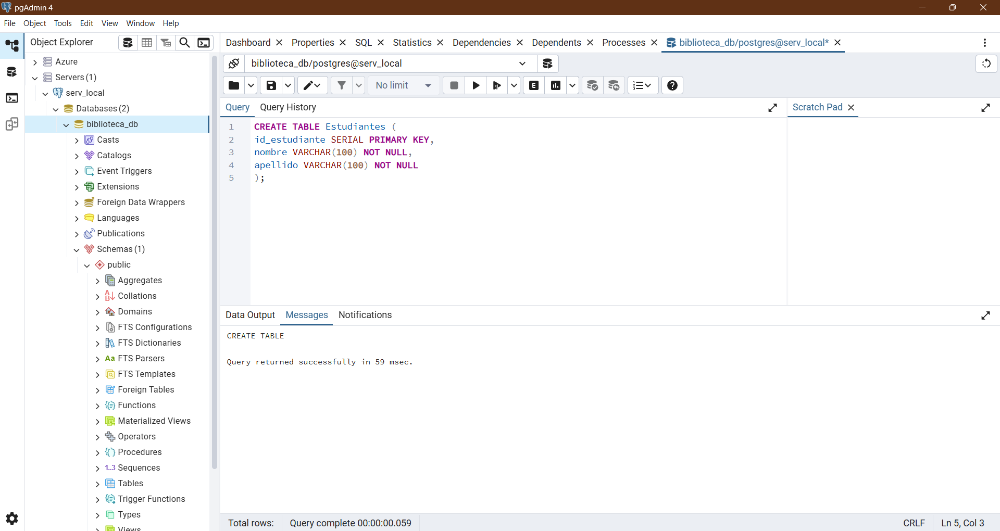
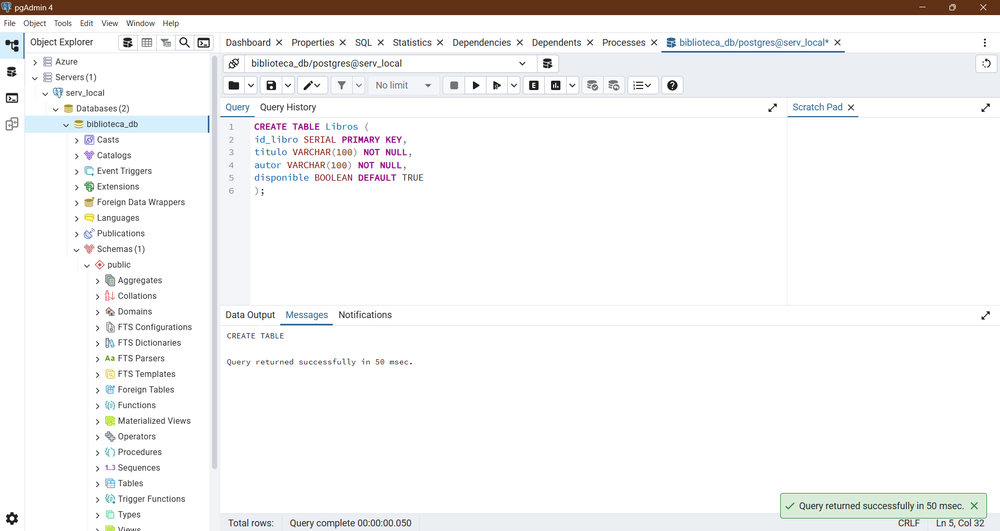
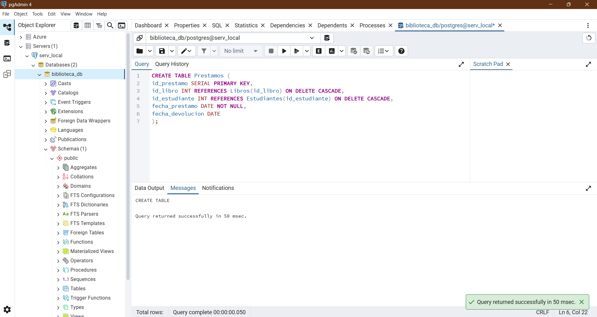
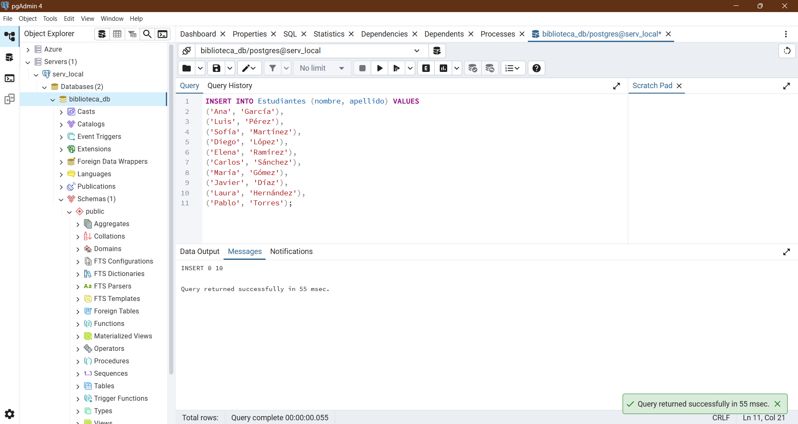
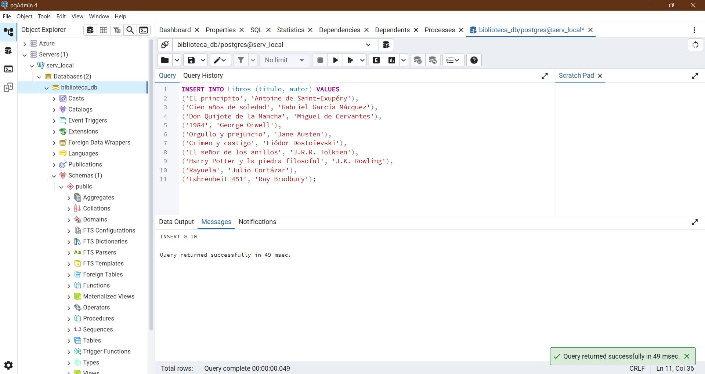
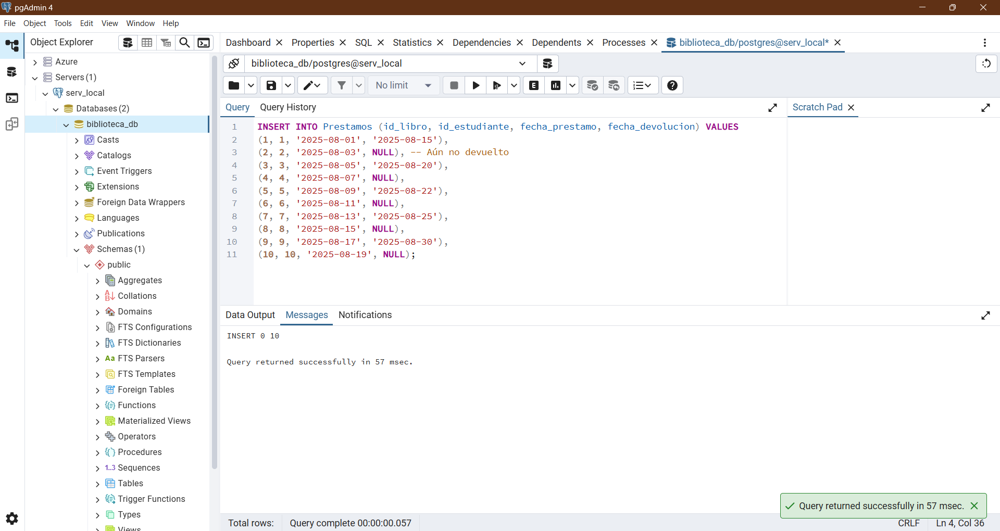
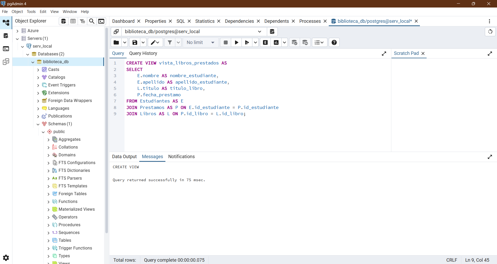
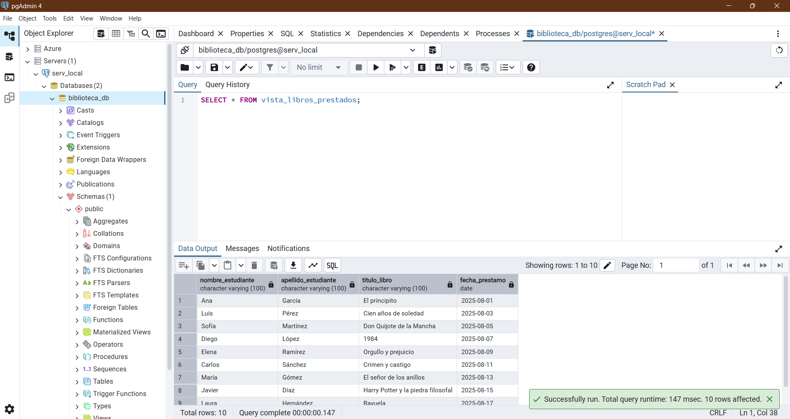

# 📚 Reto de Bases de Datos: Biblioteca Escolar con PostgreSQL

¡Hola! Este repositorio contiene la solución al reto "Cómo empezar en Bases de Datos con PostgreSQL", enfocado en la creación y gestión de una base de datos para una biblioteca escolar.

---

### 🎯 Objetivo del Proyecto

El objetivo principal de este proyecto es demostrar la comprensión de los conceptos básicos de bases de datos relacionales, incluyendo:
- Diseño de un modelo **Entidad-Relación**.
- Uso de **SQL** (Structured Query Language) para la creación, inserción y consulta de datos.
- Implementación de **claves primarias y foráneas** para establecer relaciones entre tablas.
- Optimización de consultas mediante el uso de **JOINs**, **índices** y **vistas**.

---

### 🛠️ Herramientas Utilizadas

- **PostgreSQL 15+**: Sistema de gestión de bases de datos relacionales.
- **pgAdmin 4**: Interfaz de usuario para administrar la base de datos PostgreSQL.
- **SQL**: Lenguaje estándar para interactuar con la base de datos.

---

### 📦 Estructura de la Base de Datos

La base de datos, llamada `biblioteca_db`, se compone de tres tablas principales que modelan las entidades clave de una biblioteca:

1.  **`Estudiantes`**: Almacena la información de los alumnos.
    -   `id_estudiante` (PRIMARY KEY)
    -   `nombre`
    -   `apellido`

2.  **`Libros`**: Contiene los datos de los libros disponibles.
    -   `id_libro` (PRIMARY KEY)
    -   `titulo`
    -   `autor`
    -   `disponible` (BOOLEAN)

3.  **`Prestamos`**: Registra los préstamos realizados, conectando a estudiantes con libros.
    -   `id_prestamo` (PRIMARY KEY)
    -   `id_libro` (FOREIGN KEY de `Libros`)
    -   `id_estudiante` (FOREIGN KEY de `Estudiantes`)
    -   `fecha_prestamo`
    -   `fecha_devolucion`

Las relaciones son de **uno a muchos**: un estudiante puede tener varios préstamos y un libro puede ser prestado varias veces.

---

### 📝 Consultas y Vistas

El archivo `biblioteca_db.sql` incluye la secuencia de comandos para:
-   Crear las tablas con sus respectivas claves.
-   Insertar al menos 10 registros en cada tabla.
-   Realizar una consulta **JOIN** para obtener una lista de los libros prestados por cada estudiante, uniendo las tres tablas de manera eficiente.
-   Crear una **vista** (`vista_libros_prestados`) para simplificar la consulta recurrente de préstamos.

---

### 📊 Evidencia del Proyecto

Se adjuntan capturas de pantalla del resultado de las consultas ejecutadas en pgAdmin, mostrando la correcta manipulación y recuperación de los datos.

#### 1. Creación de la base de datos `biblioteca_db`

#### 2. Creación de la tabla `Estudiantes`

#### 3. Creación de la tabla `Libros`

#### 4. Creación de la tabla `Prestamos`

#### 5. Inserción de registros en la tabla `Estudiantes`

#### 6. Inserción de registros en la tabla `Libros`

#### 7. Inserción de registros en la tabla `Prestamos`

#### 8. Consulta de libros prestados por estudiante (`JOIN`)

#### 9. Creación de la vista `libros_prestados_view`

#### 10. Consulta de la vista `libros_prestados_view`

_¡Gracias por revisar el proyecto!_
